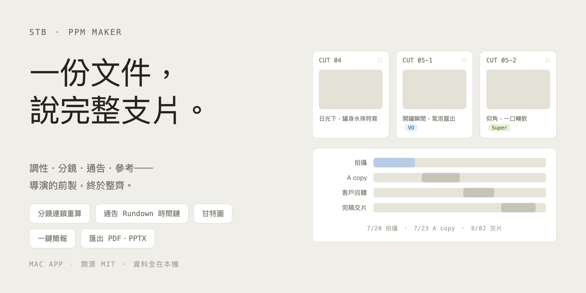
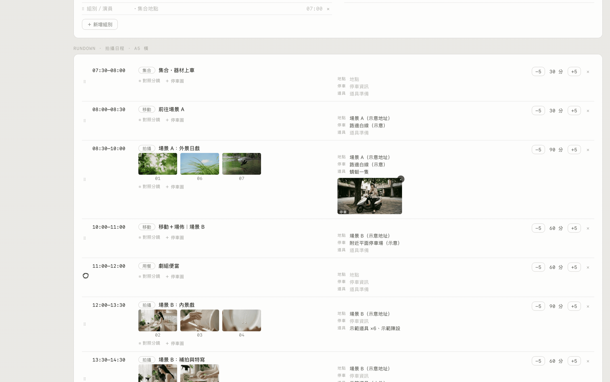

# STB - STORYBOARD

**為腳本與前製會議（PPM）而生的 Mac App。**
由台灣廣告導演 [Armin Kao（錄人影像）](https://passerstudio.com) 依自己的工作流打造。

一份 PPM 十個章節一次到位：目錄、調性、參考節奏、分鏡、REFERENCES、演員、服裝、美術、場景、製作時程。做完直接簡報，開完會直接匯出。



## 下載

👉 **[Releases 頁面下載最新版 DMG](../../releases/latest)**

**系統需求**：Apple Silicon（M1 或更新）、macOS 13 Ventura 或更新。

第一次開啟若跳「無法驗證開發者」（本 App 未購買 Apple 簽章）：
- macOS 15 以上：系統設定 → 隱私權與安全性 → 最下方「強制打開」
- 較舊版本：對 STB 按右鍵 → 打開 → 打開

## 特色

### 分鏡像積木，拖一下就換序


拖動 cut 自動重新編號，連續鏡群組（05-1/05-2）整組同行，改順序不用重編。

### 通告單＋Rundown 時間鏈



改集合時間或任一時段長度，後面全部自動順延。通告排表模式一鍵切換。

### 甘特圖


拖曳條子改期程、可選色，製作時程和通告單同一章搞定。

### 其他

- **簡報模式**——一鍵放映、鍵盤換頁；參考影片區塊內播放、首尾裁切、簡報自動播
- **匯出**——PDF（16:9）＋可編輯 PPTX（真文字框、圖片可換、影片自動轉 720p 並依裁切點嵌入）
- **資料全在本機**——無帳號、無雲端；一個案子＝一個資料夾＋一份 `project.json`

> ⚠️ 案子資料夾裡的 `assets/` 是影片素材，`project.json` 以連結掛用——
> **請勿單獨移動或刪除資料夾內的檔案**；備份或搬移請複製**整個資料夾**。

## 用 AI 寫腳本（v1.1）

STB 的真相是一份 `project.json`——**AI 改 JSON 就是改案子**，而且 App 開著時
外部修改會在 2 秒內自動重載。把 [AI編輯指南_SCHEMA.md](AI編輯指南_SCHEMA.md)
連同需求貼給 ChatGPT／Gemini／Claude（或用 Claude Code 直接開案子資料夾），
就能自然語言生腳本、改 VO、排 Rundown，STB 畫面即時跟上。

## 自己改（歡迎魔改）

技術棧：[Tauri 2](https://tauri.app)（Rust）＋ TypeScript ＋ Vite，無前端框架。

```bash
# 需求：Node.js 18+、Rust（rustup）、Xcode Command Line Tools
npm install
npm run tauri dev     # 開發模式（原生視窗＋熱更新）
npm run tauri build   # 打包 .app 與 .dmg
```

影片轉檔小幫手（`stb-trim`，Swift/AVFoundation，已附編譯好的執行檔）改了原始碼要重編：

```bash
cd src-tauri
swiftc -O -target arm64-apple-macos13.0 -o bin/stb-trim-aarch64-apple-darwin helpers/stb-trim.swift
```

三個設計原則（改之前先知道）：
1. 區塊有固定欄位，**不做自由畫布**——這個 App 的價值在結構
2. `project.json` schema 是唯一介面
3. 無後端、無雲端

## 授權

[MIT](LICENSE)——隨意使用、修改、散佈。改出有趣的東西歡迎分享。
